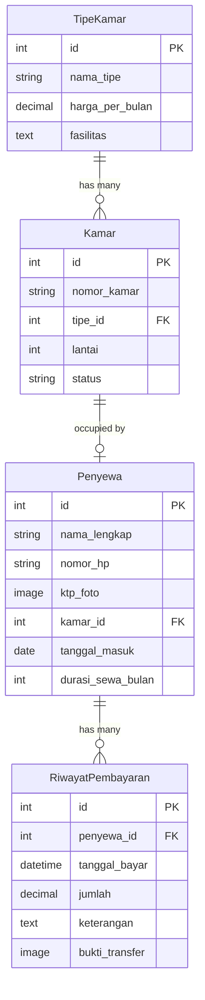

# 👑 SULTAN - Sistem Unggulan Tata Kelola Hunian

<div align="center">


**Aplikasi manajemen kost modern dengan dashboard interaktif dan API RESTful**

[Features](#-fitur-utama) • [Tech Stack](#-tech-stack) • [Installation](#-instalasi) • [API Docs](#-dokumentasi-api) • [Screenshots](#-screenshots)

</div>

---

## 📖 Deskripsi

**SULTAN** adalah aplikasi manajemen kost yang dirancang untuk memudahkan pemilik kost (juragan) dalam mengelola properti mereka. Dengan antarmuka yang modern dan intuitif, SULTAN membantu Anda:

- 🏠 Mengelola data kamar dan tipe kamar
- 👥 Mencatat data penyewa dan masa sewa
- 💰 Memantau keuangan dan riwayat pembayaran
- 📊 Visualisasi data dengan grafik interaktif
- 🔄 Otomasi status kamar (kosong/terisi)

---

## ✨ Fitur Utama

### 🎯 Dashboard Overview
- **Statistik Real-time**: Total kamar, kamar terisi, dan kamar kosong
- **Filter Dinamis**: Tampilkan kamar berdasarkan status (Semua/Kosong/Terisi)
- **Kartu Kamar Interaktif**: Lihat detail kamar dengan satu klik

### 🏢 Manajemen Kamar
- CRUD lengkap untuk data kamar
- Pencarian dan filter berdasarkan nomor, tipe, atau status
- Pagination untuk performa optimal
- Status otomatis berubah saat ada penyewa baru

### 👤 Manajemen Penyewa
- Registrasi penyewa dengan upload foto KTP
- Tracking tanggal masuk dan durasi sewa
- Perhitungan otomatis tanggal habis sewa
- Relasi one-to-one dengan kamar

### 💸 Laporan Keuangan
- **Catat Pembayaran**: Input pembayaran dari penyewa dengan bukti transfer
- **Grafik Pendapatan**: Visualisasi pendapatan bulanan dengan Chart.js
- **Riwayat Transaksi**: Timeline pembayaran lengkap dengan keterangan
- **Summary Cards**: Pendapatan bulan ini vs total pendapatan

---

## 🛠 Tech Stack

### Backend
- **Framework**: Django 5.2.8
- **API**: Django REST Framework 3.16.1
- **Database**: SQLite3 (development)
- **Authentication**: Token-based Auth
- **Documentation**: drf-spectacular (OpenAPI/Swagger)
- **Image Handling**: Pillow 12.0.0
- **CORS**: django-cors-headers 4.9.0

### Frontend
- **HTML5** + **Vanilla JavaScript**
- **CSS Framework**: TailwindCSS + DaisyUI
- **Charts**: Chart.js
- **Icons**: Font Awesome 6.4.0
- **Fonts**: Google Fonts (Poppins, Montserrat)

---

## 📦 Instalasi

### Prerequisites
- Python 3.10+ 
- pip (Python package manager)
- Git

### Step-by-Step

#### 1️⃣ Clone Repository
```bash
git clone https://github.com/username/aplikasi_juragan_kost.git
cd aplikasi_juragan_kost
```

#### 2️⃣ Buat Virtual Environment
```bash
# Windows
python -m venv env
env\Scripts\activate

# Linux/Mac
python3 -m venv env
source env/bin/activate
```

#### 3️⃣ Install Dependencies
```bash
pip install -r requirements.txt
```

#### 4️⃣ Migrasi Database
```bash
cd project_sultan
python manage.py makemigrations
python manage.py migrate
```

#### 5️⃣ Buat Superuser (Admin)
```bash
python manage.py createsuperuser
```

#### 6️⃣ Jalankan Development Server
```bash
python manage.py runserver
```

Server akan berjalan di: **http://127.0.0.1:8000/**

#### 7️⃣ Buka Frontend
Buka file `frontend-sultan/index.html` di browser, atau gunakan Live Server.

---

## 🗂 Struktur Project

```
aplikasi_juragan_kost/
│
├── env/                          # Virtual environment (ignored)
│
├── project_sultan/               # Django Backend
│   ├── kost/                     # Main App
│   │   ├── models.py            # Database Models
│   │   ├── views.py             # API ViewSets
│   │   ├── serializers.py       # DRF Serializers
│   │   ├── api_urls.py          # API Routes
│   │   └── admin.py             # Django Admin Config
│   │
│   ├── project_sultan/           # Project Settings
│   │   ├── settings.py          # Configuration
│   │   ├── urls.py              # Root URLs
│   │   └── wsgi.py              # WSGI Entry Point
│   │
│   ├── media/                    # Uploaded Files
│   │   ├── ktp_penyewa/         # KTP Photos
│   │   └── bukti_bayar/         # Payment Proofs
│   │
│   ├── db.sqlite3               # Database (ignored)
│   └── manage.py                # Django CLI
│
├── frontend-sultan/              # Frontend Dashboard
│   ├── index.html               # Main Dashboard
│   ├── login.html               # Login Page
│   └── app.js                   # JavaScript Logic
│
├── requirements.txt              # Python Dependencies
├── .gitignore                   # Git Ignore Rules
└── README.md                    # This File
```

---

## 🗄 Database Schema



---

## 🔌 API Endpoints

Base URL: `http://127.0.0.1:8000/api/`

### 🏠 Kamar
| Method | Endpoint | Description |
|--------|----------|-------------|
| GET | `/kamar/` | List semua kamar (with pagination) |
| POST | `/kamar/` | Tambah kamar baru |
| GET | `/kamar/{id}/` | Detail kamar |
| PUT/PATCH | `/kamar/{id}/` | Update kamar |
| DELETE | `/kamar/{id}/` | Hapus kamar |

**Query Parameters:**
- `?status=KOSONG` - Filter by status
- `?search=101` - Search by nomor/tipe
- `?page=2` - Pagination

### 👥 Penyewa
| Method | Endpoint | Description |
|--------|----------|-------------|
| GET | `/penyewa/` | List semua penyewa |
| POST | `/penyewa/` | Tambah penyewa baru |
| GET | `/penyewa/{id}/` | Detail penyewa |
| PUT/PATCH | `/penyewa/{id}/` | Update penyewa |
| DELETE | `/penyewa/{id}/` | Hapus penyewa (checkout) |

### 💰 Pembayaran
| Method | Endpoint | Description |
|--------|----------|-------------|
| GET | `/pembayaran/` | List riwayat pembayaran |
| POST | `/pembayaran/` | Catat pembayaran baru |
| GET | `/pembayaran/{id}/` | Detail pembayaran |

### 📊 Statistik
| Method | Endpoint | Description |
|--------|----------|-------------|
| GET | `/statistik/dashboard/` | Data dashboard (total kamar, terisi, kosong) |
| GET | `/statistik/keuangan/` | Data keuangan (bulan ini, total, grafik) |

---

## 📚 Dokumentasi API

Setelah server berjalan, akses dokumentasi interaktif di:

- **Swagger UI**: http://127.0.0.1:8000/api/schema/swagger-ui/
- **ReDoc**: http://127.0.0.1:8000/api/schema/redoc/
- **OpenAPI Schema**: http://127.0.0.1:8000/api/schema/

---

## 🎨 Screenshots

### Dashboard Overview

*Dashboard dengan statistik real-time dan kartu kamar interaktif*

### Data Kamar

*Tabel data kamar dengan pencarian dan filter*

### Laporan Keuangan

*Grafik pendapatan dan riwayat transaksi*

---

## 🚀 Deployment

### Production Checklist

1. **Update Settings**
```python
# settings.py
DEBUG = False
ALLOWED_HOSTS = ['yourdomain.com']
SECRET_KEY = os.environ.get('SECRET_KEY')
CORS_ALLOW_ALL_ORIGINS = False
CORS_ALLOWED_ORIGINS = ['https://yourdomain.com']
```

2. **Database**
   - Ganti SQLite dengan PostgreSQL/MySQL untuk production
   - Backup database secara berkala

3. **Static Files**
```bash
python manage.py collectstatic
```

4. **Environment Variables**
   - Gunakan `.env` file untuk kredensial sensitif
   - Jangan commit `.env` ke Git

5. **Web Server**
   - Gunakan Gunicorn + Nginx untuk production
   - Setup SSL certificate (Let's Encrypt)

---

## 🤝 Contributing

Kontribusi sangat diterima! Silakan:

1. Fork repository ini
2. Buat branch baru (`git checkout -b feature/AmazingFeature`)
3. Commit perubahan (`git commit -m 'Add some AmazingFeature'`)
4. Push ke branch (`git push origin feature/AmazingFeature`)
5. Buat Pull Request

---

## 📝 License

Distributed under the MIT License. See `LICENSE` for more information.

---

## 👨‍💻 Author

**Your Name**
- GitHub: [@yourusername](https://github.com/yourusername)
- Email: your.email@example.com

---

## 🙏 Acknowledgments

- [Django](https://www.djangoproject.com/) - The web framework for perfectionists
- [DRF](https://www.django-rest-framework.org/) - Powerful and flexible toolkit for building Web APIs
- [TailwindCSS](https://tailwindcss.com/) - A utility-first CSS framework
- [DaisyUI](https://daisyui.com/) - The most popular component library for Tailwind CSS
- [Chart.js](https://www.chartjs.org/) - Simple yet flexible JavaScript charting

---

<div align="center">

**⭐ Jangan lupa kasih star kalau project ini membantu! ⭐**

Made with ❤️ and ☕ by Juragan Kost Developers

</div>
